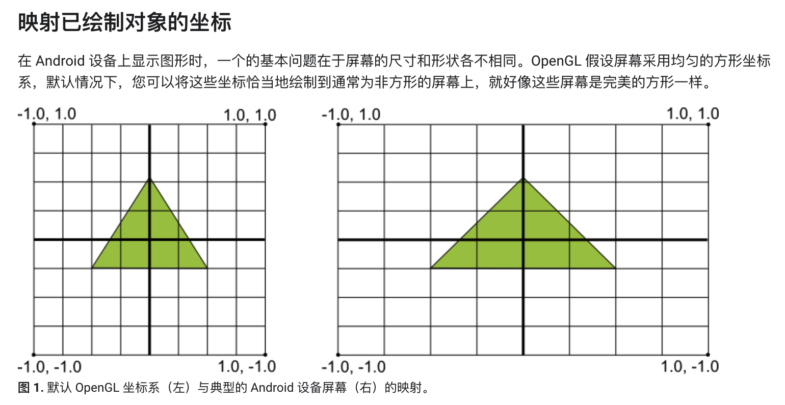

# 定义形状

## 定义三角形

```java
public class Triangle {

    private FloatBuffer vertexBuffer;

    static final int COORDS_PER_VERTEX = 3;
    static float triangleCoords[] = { // in counterclockwise order:
        0.0f,  0.622008459f, 0.0f, // top
       -0.5f, -0.311004243f, 0.0f, // bottom left
        0.5f, -0.311004243f, 0.0f  // botton right
    };
    // Set color with red , green, blue and alpha (opacity) values
    float color[] = { 0.63671875f, 0.76953125f, 0.22265625f, 1.0f };

    public Triangle() {
        ByteBuffer bb = ByteBuffer.allocateDirect(triangleCoords.length * 4); // 1 float = 4 byte
        // Use the device hardware's native byte order
        bb.order(ByteOrder.nativeOrder());
        // Create a floating point buffer from the ByteBuffer
        vertexBuffer = bb.asFloatBuffer();
        // Add the coordinates to the FloatBuffer
        vertexBuffer.put(triangleCoords);
        // Set the buffer to read the first coordinate
        vertexBuffer.position(0);
    }
}
```

- 默认情况下，OpenGL ES的坐标系为：[0,0,0]指定GLSurfaceView帧的中心，[1,1,0]指定帧的右上角，[-1,-1,0]指定帧的左下角：
- 默认情况下，OpenGL ES的绘制顺序为CounterClockwise（逆时针绘制），该顺序影响了面剔除功能：
```java
// Enable face culling feature
gl.glEnable(GL10.GL_CULL_FACE);
// Specify which faces to not draw
gl.glCullFace(GL10.GL_BACK);
```

## 定义方形
```java
public class Square {

    private FloatBuffer vertexBuffer;
    private ShortBuffer drawListBuffer;
    // Number of coordinates per vertex in this array
    static final int COORDS_PER_VERTEX = 3;
    static float squareCoords[] = {
        -0.5f,  0.5f,  0.0f,    // top left
        -0.5f, -0.5f,  0.0f,    // bottom left
         0.5f, -0.5f,  0.0f,    // bottom right
         0.5f,  0.5f,  0.0f     // top right
    };

    private short drawOrder[] = { 0, 1, 2, 0, 2, 3 }; // order to draw vertices

    public Square() {
        ByteBuffer bb = ByteBuffer.allocateDirect(squareCoords.length * 4); // 1 float = 4 byte
        bb.order(ByteOrder.nativeOrder());
        vertexBuffer = bb.asFloatBuffer();
        vertexBuffer.put(squareCoords);
        vertexBuffer.position(0);

        ByteBuffer dlb = ByteBuffer.allocateDirect(drawOrder.length * 2); // 1 short = 2 byte
        dlb.order(ByteOrder.nativeOrder());
        drawListBuffer = dlb.asShortBuffer();
        drawListBuffer.put(drawOrder);
        drawListBuffer.position(0);
    }
}
```
